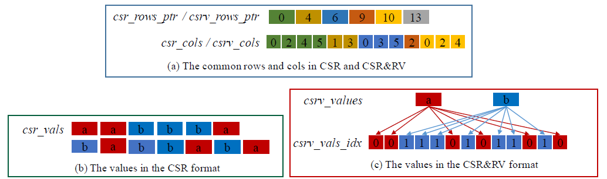
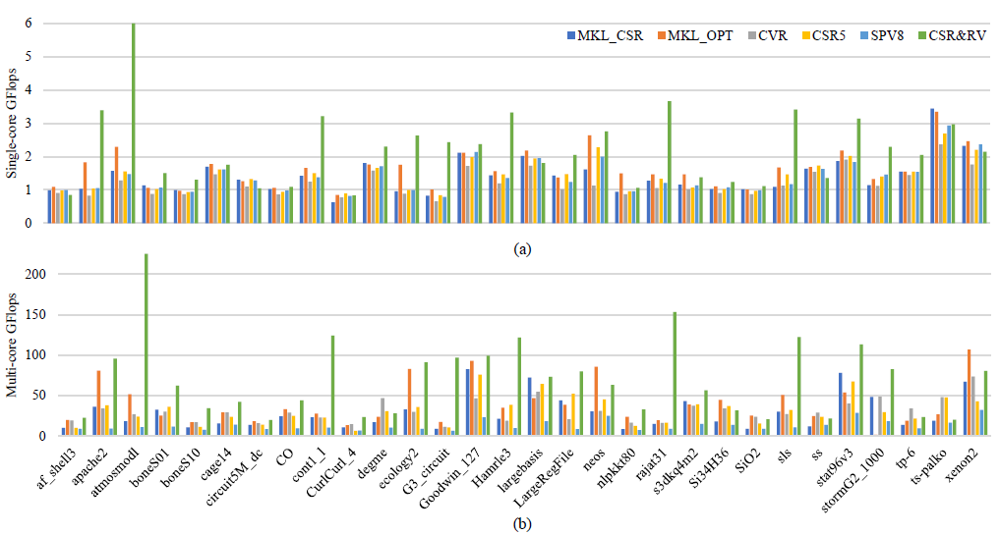
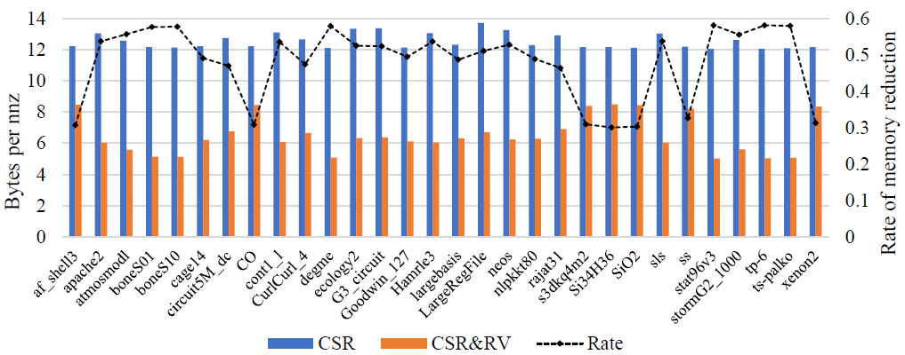
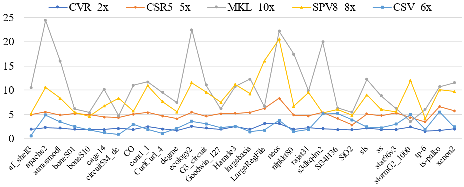

# CSR&RV

An official source code for paper [CSR&RV: An Efficient Value Compression Format for Sparse Matrix-vector Multiplication](https://dl.acm.org/doi/abs/10.1007/978-3-031-21395-3_5), accepted by the 19th IFIP International Conference on Network and Parallel Computing, NPC 2022. Any communications or issues are welcomed. Please contact shuaicaijunjun@126.com. If you find this repository useful to your research or work, it is really appreciate to star this repository. :heart:

-------------

### Overview

<p align = "justify"> 
    Sparse Matrix-Vector Multiplication (SpMV) plays a critical role in many areas of science and engineering applications. The storage space of value array in general real sparse matrices accounts for costly. However, the existing compressed formats cannot balance the compressed rate and computational speed. To address this issue, we propose an efficient value compression format implemented by AVX512 instructions called Compressed Sparse Row and Repetition Value (CSR&RV). This format stores each different value once and uses the indexes array to store the position of values, which reduces the storage space by compressing the value array. We conduct a series of experiments on an Intel Xeon processor and compare it with five other formats in 30 real-world matrices. Experimental results show that CSR&RV can achieve a speedup up to 3.86× (1.66× on average) and a speedup up to 12.42× (3.12× on average) for single-core and multi-core throughput, respectively. Meanwhile, our format can reduce the memory space by 48.57% on average.
</p>

<div  align="center">    
    
</div>

<div  align="center">    
    The CSR&RV format
</div>


### Requirements

1. Intel Xeon Processor with AVX-512 support
2. Intel classic compiler (ICC 2021.5.0)
3. openmp for multi-threads
4. Intel math kernel library from the Intel OneAPI
5. cpupower (to set frequency, other available tools should also work)


### Compilation

For CSR&RV:
```
icc csv_avx512.cpp -o csv -O3 -std=c++11 -fopenmp
```

For MKL:
```
icc mkl.cpp -std=c++11 -L${MKLROOT}/lib/intel64 -lmkl_intel_lp64 -lmkl_intel_thread -lmkl_core -liomp5 -lpthread -lm -ldl -o mkl
```

### Dataset

All the matrices we used in our benchmark are listed in `./in/matrix93.txt`, and their files are publicly available on [SuiteSparse Matrix Collection](https://sparse.tamu.edu/).


### Baselines

This repo only contains two kernel for CSR&RV and MKL. For other methods like CVR, CSR5 and SPV8, we reused kernels provided in [puckbee/CVR](https://github.com/puckbee/CVR), [weifengliu-ssslab / Benchmark_SpMV_using_CSR5](https://github.com/weifengliu-ssslab/Benchmark_SpMV_using_CSR5)) and [monkey2000/spv8-public](https://github.com/monkey2000/spv8-public). These kernels are collected from the original authors. And we only modified their output code to simplify data collection.


### Results

<div  align="center">    
    
</div>

<div  align="center">    
    The overall preformance in different formats
</div>
<br>

<div  align="center">    
    
</div>

<div  align="center">    
    Memory reduction in the CSR&RV format compares to CSR
</div>
<br>

<div  align="center">    
    
</div>

<div  align="center">    
    The pre-processing overload in different formats
</div>


### Citation

If you use code or datasets in this repository for your research, please cite our paper.

```
@inproceedings{CSRRV,
    author = {Yan, Junjun and Chen, Xinhai and Liu, Jie},
    title = {CSR\&RV: An Efficient Value Compression Format for Sparse Matrix-Vector Multiplication},
    year = {2022},
    isbn = {978-3-031-21394-6},
    publisher = {Springer-Verlag},
    address = {Berlin, Heidelberg},
    doi = {10.1007/978-3-031-21395-3_5},
    booktitle = {Network and Parallel Computing: 19th IFIP WG 10.3 International Conference, NPC 2022},
    pages = {54–60},
    numpages = {7},
    location = {Jinan, China}
}
```
